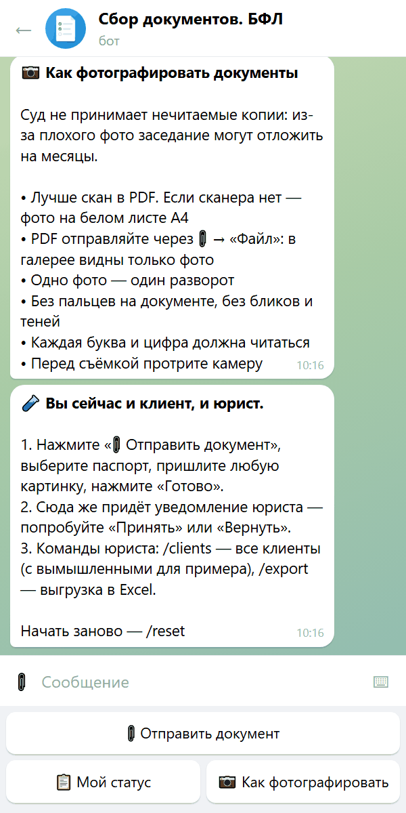
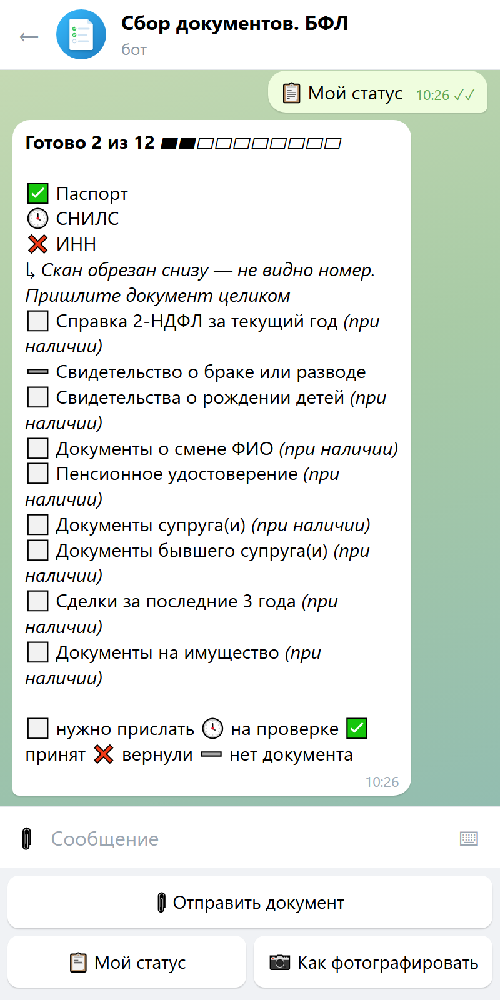
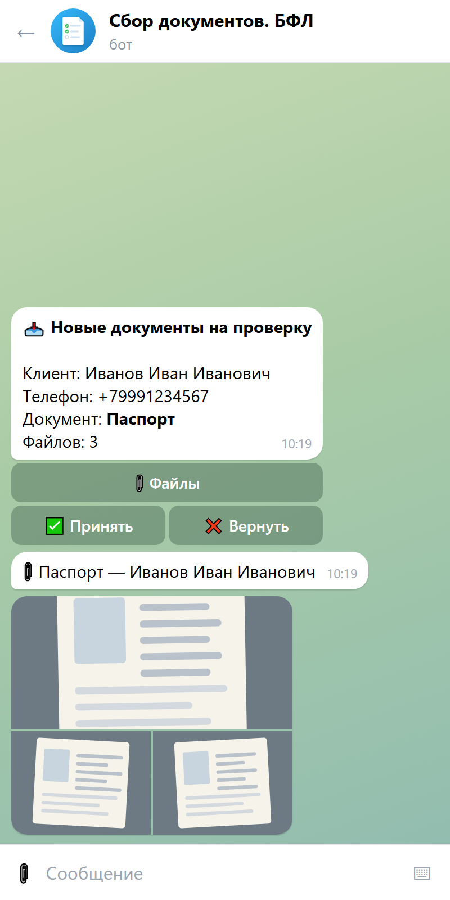
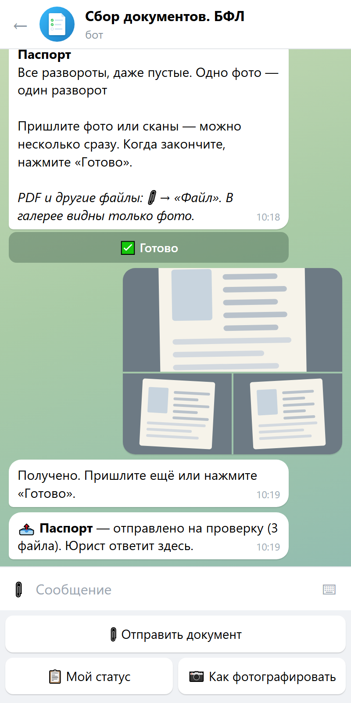
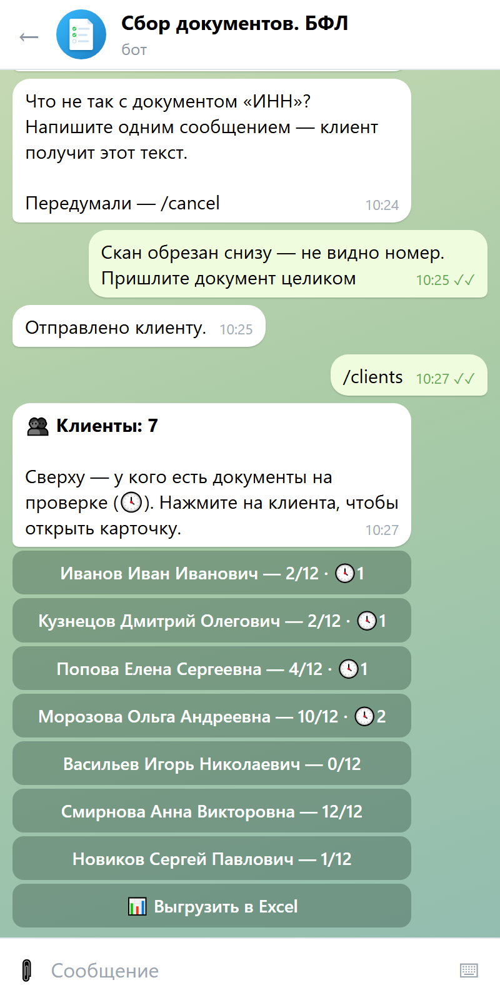
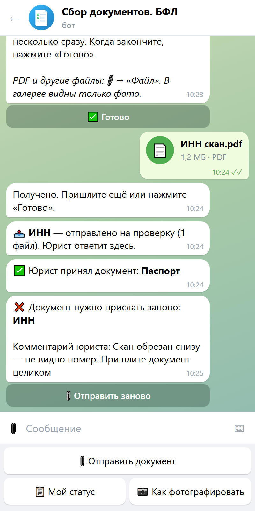
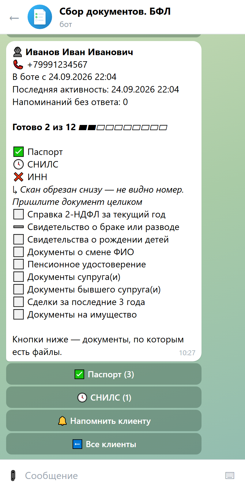
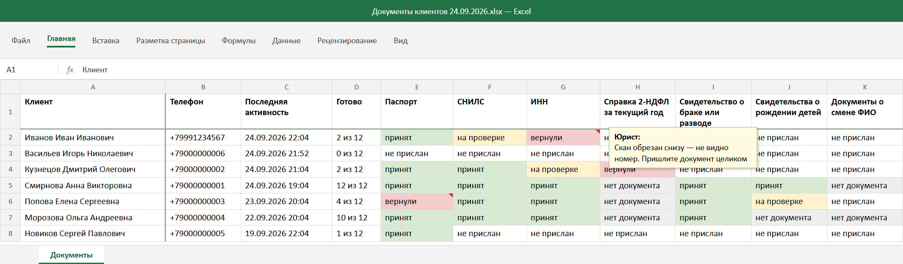

<div align="center">

# Бот для сбора документов на банкротство физлиц

**Telegram-бот для юридических фирм. Клиент присылает документы по чек-листу, бот следит за комплектностью и сам напоминает о недостающем, юрист проверяет каждый документ в один клик.**

<br>

<a href="https://t.me/documents_bfl_bot"></a>

### 👉 [@documents_bfl_bot](https://t.me/documents_bfl_bot) — пройдите путь клиента и юриста за 2 минуты

Вы одновременно клиент и юрист · телефон не нужен · ваши данные видите только вы

<br>



[](https://github.com/krein15/bankruptcy-docs-bot/actions/workflows/tests.yml)

</div>

---

## Какую проблему решает

Юрист даёт клиенту список документов картинкой. Клиент шлёт файлы в чат вперемешку и путается, что уже отправил. Юрист вручную сверяет комплектность и вручную напоминает про недостающее. **На каждого клиента — часы.**

| Было | С ботом |
|---|---|
| Список документов — картинкой в переписке | Чек-лист в боте, у каждого пункта — подсказка, что именно нужно |
| Файлы приходят вперемешку, непонятно, что к чему | Каждый файл сразу привязан к пункту списка |
| Клиент не помнит, что уже отправил | `📋 Мой статус`: ✅ принят · 🕓 на проверке · ❌ вернули · ⬜ нужно прислать |
| Юрист сверяет комплектность вручную | Прогресс по каждому клиенту в списке и в Excel |
| Юрист сам напоминает о недостающем | Бот напоминает через 48 часов — днём и без спама |
| Замечания к сканам теряются в переписке | «Вернуть» с комментарием — клиент видит, что исправить |

## Попробуйте за 2 минуты

1. Откройте **[@documents_bfl_bot](https://t.me/documents_bfl_bot)** и нажмите «Начать».
2. Дайте согласие и введите любое ФИО — телефон в демо не спрашивается.
3. «📎 Отправить документ» → «Паспорт» → любая картинка → «Готово».
4. В этот же чат придёт уведомление юриста — нажмите «Принять» или «Вернуть» с комментарием.
5. `/clients` — список клиентов с прогрессом, `/export` — выгрузка в Excel.

> ⚠️ Это демо: не отправляйте настоящие документы — подойдёт любая картинка. Ваших данных не видит никто, кроме вас. Начать заново — `/reset`.

## Как это выглядит

| Клиент | Юрист |
|:---:|:---:|
| <br>Чек-лист и прогресс | <br>Уведомление: принять или вернуть |
| <br>Отправка документа | <br>Все клиенты с прогрессом |
| <br>Документ вернули с комментарием | <br>Карточка клиента |

<p align="center"><br>Выгрузка в Excel: клиенты × документы, цвет — статус, причина возврата — в примечании</p>

<sub>Картинки собраны из настоящих ответов бота: сценарий прогоняется через бота, а переписка рисуется в стиле Telegram (<code>scripts/render_screenshots.py</code>). Клиенты и документы на них вымышленные.</sub>

## Возможности

**Для клиента**
- Чек-лист документов с подсказками: что именно сфотографировать и как
- Фото и PDF, по одному или альбомом — каждый файл сразу привязан к пункту списка
- Кнопка «У меня его нет» для необязательных документов (брак, дети, имущество)
- Статус по каждому документу и комментарии юриста
- Правила съёмки, чтобы суд не вернул нечитаемые копии

**Для юриста**
- Уведомление о каждом новом документе с кнопками «Принять» / «Вернуть»
- Файлы клиента — альбомом в один клик
- Список клиентов: сверху те, у кого есть что проверить
- Карточка клиента: контакты, прогресс, документы, кнопка «Напомнить»
- Выгрузка в Excel для отчёта и печати

**Бот сам**
- Напоминает клиенту, если он прислал файлы, но забыл отправить их юристу
- Напоминает о недостающем, если клиент молчит 48 часов
- Пишет только днём по часовому поясу фирмы и не больше 5 раз подряд

## Адаптация под вашу фирму

Под фирму настраивается **за один день, без переделки бота**:
- список документов и подсказки к ним — под вашу практику;
- тексты, название, приветствие;
- юристы, которым приходят документы;
- часовой пояс и график напоминаний.

**Доработки под задачи фирмы:**
- 📝 **Анкета → личный список документов.** «В браке? Дети? Был ИП? Есть авто?» — список собирается под обстоятельства клиента
- 🗄 **Архив файлов** на вашем сервере или Яндекс Диске, ZIP-архив по каждому клиенту
- 🔗 **Интеграция с CRM** — amoCRM, Bitrix24: сделка, статус, файлы
- 👥 **Несколько юристов** — ссылка-приглашение, клиент сразу закреплён за своим юристом
- ⚖️ **Статус дела для клиента** — «заявление подано», «заседание 12.11»

Установка на ваш сервер или размещение у меня с сопровождением.

## Безопасность и персональные данные

- При регистрации клиент даёт согласие на обработку персональных данных (152-ФЗ)
- Бот не хранит сами файлы — только ссылки Telegram на них. Если нужно хранить копии у себя — модуль архива
- Бот никогда не просит пароли — ни от Госуслуг, ни от банков
- Кнопки юриста работают только у юристов фирмы: права проверяются при каждом нажатии
- Каждое изменение бота проверяют больше сотни автотестов

## Автор

**Бондаренко Николай** — Telegram-боты и автоматизация на Python для бизнеса. Нужен такой бот для вашей фирмы или доработка под ваши процессы — пишите, покажу бота на созвоне.

- Telegram: [@krein1](https://t.me/krein1)
- Email: [reinkolya@gmail.com](mailto:reinkolya@gmail.com)
- GitHub: [krein15](https://github.com/krein15)

---

## Для разработчиков


### Запуск

```powershell
python -m venv .venv
.venv\Scripts\pip install -r requirements.txt
copy .env.example .env          # впишите BOT_TOKEN и LAWYER_IDS
.venv\Scripts\python -m bot     # или двойной щелчок по run.bat
```

Демо-режим — `DEMO_MODE=true` в `.env`. Вымышленные клиенты для скриншотов — `python -m scripts.seed_demo` (удалить: `--clear`).

### Тесты

```powershell
.venv\Scripts\pip install -r requirements-dev.txt
.venv\Scripts\python -m pytest    # или двойной щелчок по test.bat
```

Тесты общаются с ботом через подставной Telegram: пишут от имени клиента и юриста, жмут кнопки и проверяют ответы и записи в базе. На GitHub они запускаются при каждом push.

### Картинки для README

```powershell
.venv\Scripts\python -m scripts.render_screenshots   # из PowerShell, нужен Microsoft Edge
```

Скрипт прогоняет сценарии через ту же подставную обвязку, что и тесты, рисует ответы бота в стиле Telegram и снимает их Edge'ем: `docs/screenshots/*.png` и `docs/demo.gif`. Поменяли тексты — перезапустите, и картинки совпадут с ботом.

### Устройство

```
bot/
├── __main__.py      запуск, планировщик напоминаний, меню команд
├── config.py        настройки из .env
├── checklist.py     загрузка и проверка checklist.json
├── db.py            SQLite: все запросы и миграции схемы
├── texts.py         все тексты бота
├── keyboards.py     все кнопки
├── handlers/
│   ├── client.py    регистрация, приём файлов, статус
│   └── lawyer.py    проверка документов, клиенты, Excel
├── reminders.py     кому и когда напомнить
└── export.py        Excel-отчёт
checklist.json       список документов — главное, что меняется под фирму
scripts/seed_demo.py вымышленные клиенты для демо
scripts/render_screenshots.py  картинки для README из ответов бота
tests/               автотесты
```

Несколько решений, которые стоит знать:
- **Файлы не хранятся** — только `file_id` Telegram: бот пересылает файл юристу по ссылке, без диска и хранилища.
- **Этап регистрации вычисляется по базе**, а не по памяти бота — после перезапуска клиент продолжает с того же места.
- **Миграции через `PRAGMA user_version`** — при обновлении бота база фирмы дополняется, а не пересоздаётся.
- **Демо — песочница**: посетитель видит только себя и вымышленных клиентов; доступ проверяется при каждом нажатии, потому что данные кнопок можно подделать.

## Лицензия

© 2026 Бондаренко Николай. Все права защищены. Код открыт для ознакомления; использование, копирование и распространение — только с письменного разрешения автора. Подробнее — в [LICENSE](LICENSE).

<sub>Ключевые слова: Telegram-бот для юристов, банкротство физических лиц, 127-ФЗ, сбор документов, чек-лист документов для банкротства, автоматизация юридической фирмы, legaltech, aiogram.</sub>
